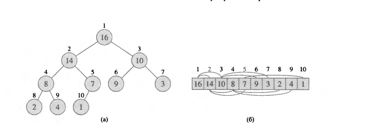
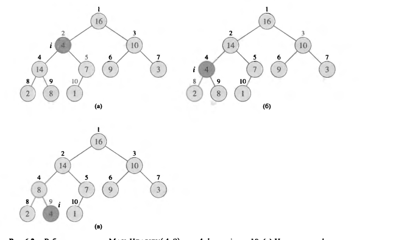
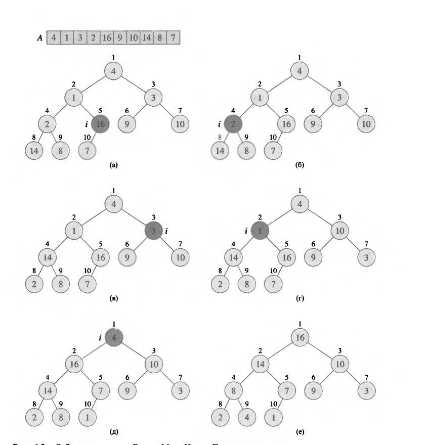
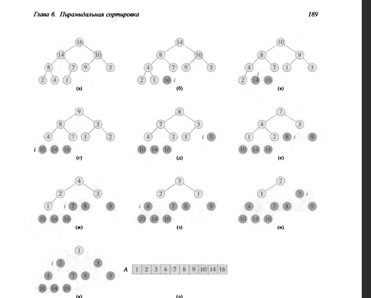

## Пирамидальная сортирока + пирамида
## Heap

Структура данных пирамида представляет собой обьект-массив который можно рассматривать почти как полное бинарное дерево.



Массив A представляющий пирамиду является обьектом с двумя аттрибутами **A.length** (кол-во элементов в массиве) **A.heap-size** (сколько элементов прямо сейчас содержится в массиве).

_**Внимание, в примере представлен массив который начинается с 1**_

**Корнем** дерева является A[1]

Для текущего A[i] элемента очень просто вычислить индексы его родителя, левого и правого дочернего узла

```cs
T GetParent(i){
    return i/2
}

T GetLeft(i){
    return 2*i
}

T GetRight(i){
    return 2*i + 1
}
```

Различают два вида бинарных пирамид:

1) Неубывающие (по русски возрастающие)

2) Невозрастающие (по русски убывающие)

В пирамидах обоих видос значения, расположенные на узлах удовлетворяют **свойству пирамиды**.

**Для невозрастающей это:**

```cs
A[Parent(i)] >= A[I]
```
Наименьший элемент в крайнем листе

**Для неубывающей это:**

```cs
A[Parent(i)] <= A[I]
```
Наименьший элемент в корне

Рассматривая пирамиду как дерево, нам надо определить ее высоту = число ребер в самом длинном просто нисходящем пути от этого узла к какому-то из листьев дерева.

Т.к n-элементная пирамида строится по принципу полного бинарного дерева, ее высота равна T(log n)

Выполнение основных операций приблизительно пропорционально высоте дерева, и таким образом эти операции требуют O(log n)

Процедуры:

1) Процедура **_Max-Heapify_** выполняется за O(log n) и служит для поддержки свойства невозрастающей пирамиды.

2) Время выполнения процедуры **_Build-Max-Heap_** увеличивается с ростом количества элементов линейно. Эта процедура предназначена для создания невозрастающей пирамиды из неупорядоченного входного массива.

3) Процедура **_Heapsort_** выполняется за O(n logn) и сортирует массив без доп.памяти

4) Процедуры **_Max-Heap-Insert_**, **_Heap-Extract-Max_**, **_Heap-Increase-Key_** и **_Heap-Maximum_** выполняются за O(logn) и позволяют использовать пирамиду для реализации очереди с приоритетами.


## Поддержка свойств пирамиды



```cs
void MaxHeapify(int[] a, i){
    l = Left(i);
    r = Right(i)

    if (l <= A.heap_size && A[l] > A[i]){ 
        // если левый ребенок больше чем текующий 
        largest = l
    }
    else {
        largest = i
    }
    if (r <= A.heap_size && A[r] > A[largest]){ 
        // если правый ребенок больше наибольший узел (левое) 
        largest = r
    }

    if (largest != i){
        swap (A[i], A[largest])
        MaxHeapify(A, largest)
    }
}
```

Время работы процедуры MaxHeapify = **_T(n) <= T(2n/3) + T(1)_**

## Построение пирамиды

Процедуру MaxHeapify можно использовть в восходящем направлении для того, чтобы преобразовывать массив ```A[1..n]```, где  n = A.length в невозрастающую пирамиду. 

```cs
void BuildMaxHeap(int[]){
    for (var i = A.length / 2, i > 1, i--){
        MaxHeapify(A, i)
    }
}
```




## HeapSort 

**Асимптотика : O(n logn)**

Сортировка выполняется без доп памяти.

В алгоритме используется невозрастающая пирамида

Работа начинается с вызова BuildMaxHeap, т.к наибольший элемент в корне - мы можем положить его на последнее место в итоговом массиве на позицию ```A[n]```

Уменьшем кучу - убираем корневой элемент, видим что только корень нарушает структуру неубывающей последовательности и вызываем ```MaxHeapify(A,i)```


```cs
void HeapSort(A){
    BuildMaxHeap(A);
    for (var i = A.length, i > 2, i--){
        swap(A[1], A[i])
        --A.heap_size;
        MaxHeapify(A, 1)
    }
}
```



## Очередь с приоритетом

Представляет собой структуру данных, предназначенную для обслуживания множества S, с каждым элементом которого связано определенное значение, называющимся ключом (key). В невозрастающей очереди с приоритетом поддерживаются следующие команды:

1) ```Insert(S,x)``` - вставляет элемент x в множество S

2) ```Maximum(S)``` - возвращает элемент множества S с наибольшим ключом

3) ```Extract-Max(S)``` - удаляет и возвращает макс.элемент множества S

4) ```Increase-Key (S,x,k)``` - увеличивает значение ключа элемента x до нового значения k, где k >= x


```cs
T HeapMaximum(A){
    return A[1]
}

// O(logn)
T HeapExtractMax(A){
    if (A.heap_size < 1){
        throw SomeException("Очередь пуста")
    }
    max = A[1];
    A[1] = A[A.heap_size];
    A.heap_size = A.heap_size -1;
    MaxHeapify(A, 1)
    return max;
}

// O(logn)
void HeapIncreaseKey(A, i, key){
    if (key < A[i]){
        throw SomeException("Новый ключ меньше текущего")
    }
    A[i] = key;
    while (i > 1 && A[Parent(i)] < A[i])
    {
        swap(A[i], A[Parent(i)])
    } 
    
}
```