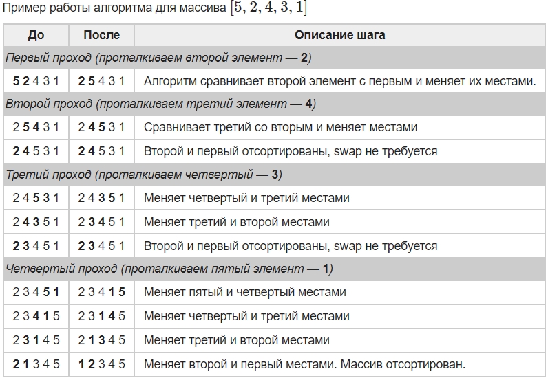

## Сортировка

Прежде чем начать разбирать отдельные виды сортировок, вам нужно для себя понять, что вообще значит сортировка и в каких структурах она применяется.

Сортировка - это упорядочивание элементов структуры по убыванию/возрастанию. Сортировка ЭТО УЖЕ КАКОЙ-ТО АЛГОРИТМ.
Что мы сортриуем?: Числа, строки, объекты (по их полям) и тд. Сортировуем мы прежде всего элементы массивов.

## Сортировка вставками (Insertion sort)

Суть в чем: 

У нас есть часть массива, которая уже отсортирована (это может быть даже один элемент), а дальше мы будем ВСТАВЛЯТЬ оставшиеся элементы в нужные позиции этой самой отсортированной части.

Будем считать первый элемент массива отсортированной частью, проходим по массиву слева направо и обрабатываем по очереди каждый элемент. 

ВСТАВКА происходит простым образом: мы запускаем цикл по сорченной части, сравнивая его с каждым элементом и свапая их местами (каждый такой свап == одной ИНВЕРСИИ)
## Полезные ссылки
[Сортировки на примере народных танцев](https://forany.xyz/a-370)

## Инверсия

Инверсией в перестановке мы называем пару ИНДЕКСОВ, такую, что 1 <=i < j <=n и arr[i] > arr[j];
Говоря просто:

Вот массив:      3 2 1
Вот его индексы: 0 1 2

0 < 1 и arr[0] > arr[1], то есть 3 > 2 - это инверсия
И таких инверсий тут будет 3 штуки (подумайте, почему).

## Код

```
for (int i = 1; i < arr.size(), ++i){
    j = i;
    while (j >= 0 and arr[j] < arr[j-1]){
        swap(arr[j], arr[j-1])
        j--;
    }
}
```

Другой пример кода приведён в презентации лекции
P.S: for с 1 т.к. первый элемент считаем отсортированным
P.S: подумайте, как в сортировке вставками считать число инверсий



## Асимптотическая оценка

### По времени:

Как видно из псевдокода, в худшем случае наш алгоритм отработает за O(n^2). 
Наихудший пример: элементы отсортированы в обратном порядке

В лучшем случае мы вообще не зайдём в цикл while и отработаем за линию O(n). 
Очев, что лучший случай, это когда наш массив целиком отсортирован.

В среднем мы отработаем, как ни странно, за O(n^2). Почему? Я хз как это корректно объяснить, тут надо в математику

### По памяти:

В этом алгоритме помимо входного массива мы не прибегаем ни к какому заимствованию памяти, следовательно M(1)


## Примерчик

22 6 4 2 14
22 - отсортированная часть, идём по массиву

22 > 6? - yes -> swap, мы упёрлись в 0 элемент -> выход из while, переход по for
6 22 4 2 14

22 > 4? - yes -> swap, 6 > 4? yes -> swap
4 6 22 2 14

И так далее, в результате получим 
2 4 6 14 22

Подумайте, как поменять код выше, чтобы отсортировать массив в обратном порядке 

## Инвариант

Инвариант цикла - это логическое выражение, зависящее от задачи, решаемой при помощи этого цикла
У инварианта есть три свойства:

Инициализация. Инвариант справедлив переди инициализацией 

Сохранение. Если инвариант выполняется перед очередной итерацией цикла, то он также выполняется после неё.

Завершение. По завершении цикла инварианты позволяют убедиться в корректности алгоритма.

Инвариант на примере сор
## Видос по вставкам
https://www.youtube.com/watch?v=OGzPmgsI-pQ


## Сортировка слиянием (Merge sort)

Суть в чем: 

Алгоритм использует принцип «разделяй и властвуй»: массив рекурсивно разбивается на два равных, которые сортируются по отдельности, после чего происходит их СЛИЯНИЕ. Метод разделения ещё называется методом ДЕКОМПОЗИЦИИ.

По факту мы разбиваем массив пополам до тех пор, пока у нас не останутся одноэлементные массивчики, а затем мы их сравниваем и соединяем, сортируя самым простым образом))).

P.S: Если в рассматриваемом массиве 1 элемент, то он уже отсортирован.

## Код

Код состоит из функции merge (слияние) и самого merge sort'a

```
merge(a : int[n]; left, mid, right : int):
    it1 = 0
    it2 = 0
    result : int[right - left]
  
    while left + it1 < mid and mid + it2 < right
        if a[left + it1] < a[mid + it2]
            result[it1 + it2] = a[left + it1]
            it1 += 1
        else
            result[it1 + it2] = a[mid + it2]
            it2 += 1
  
    while left + it1 < mid
        result[it1 + it2] = a[left + it1]
        it1 += 1
  
    while mid + it2 < right
        result[it1 + it2] = a[mid + it2]
        it2 += 1
  
    for i = 0 to it1 + it2
        a[left + i] = result[i]
```

Рекурсивный merge sort: 
```
mergeSortRecursive(a : int[n]; left, right : int):
    if left + 1 >= right
        return
    mid = (left + right) / 2
    mergeSortRecursive(a, left, mid)
    mergeSortRecursive(a, mid, right)
    merge(a, left, mid, right)
```


## Асимптотическая оценка

По времени:

В данном случае алгоритм всегда работает одинаково! За O(n * log(n)) 
n раз у нас происходит слияние и log(n)

По памяти:

В этом алгоритме помимо входного массива нам нужен вспомогательный массив, следовательно M(n)

## Примерчик


